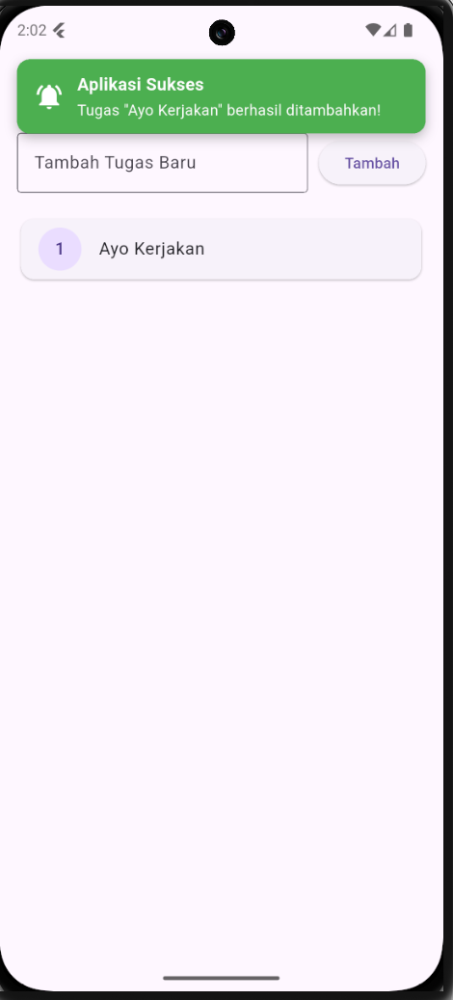
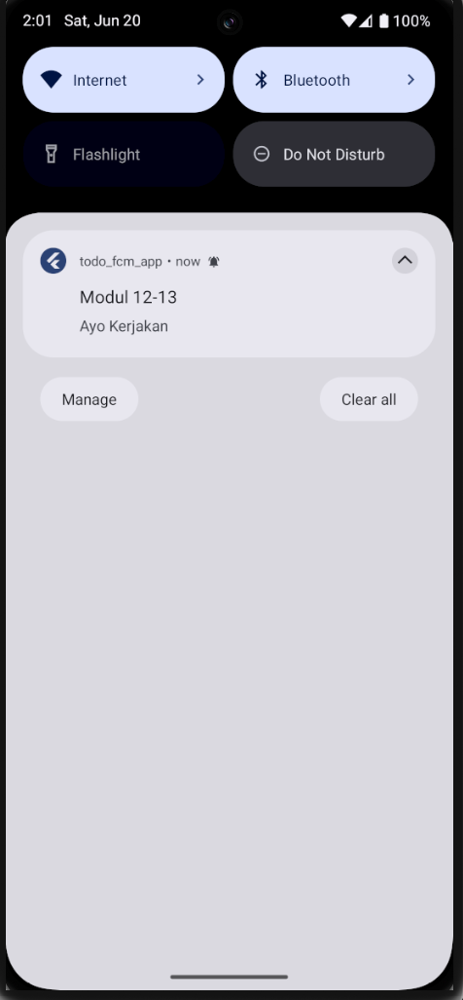
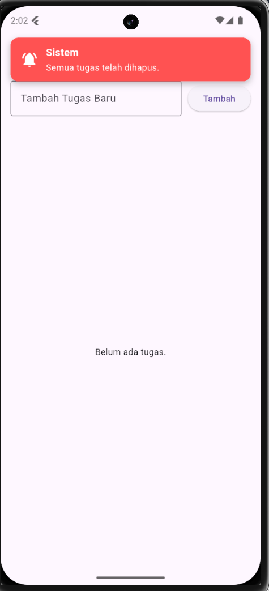

# LAPORAN PRAKTIKUM

### MODUL 12 & 13: STATE MANAGEMENT PROVIDER & FIREBASE CLOUD MESSAGING (FCM)

**Disusun Oleh:**

* **Nama:** Afrizal Dwi Nugraha
* **NIM:** 2311102136
* **Program Studi:** Informatika
* **Institusi:** Universitas Telkom Purwokerto

---

## 1. Setup Firebase Console & Registrasi Aplikasi

Langkah awal inisialisasi layanan Firebase Cloud Messaging pada Android dilakukan melalui platform Firebase Console:

1. Membuat proyek baru bernama **Modul12-13** pada platform web Firebase Console.
2. Mendaftarkan aplikasi Android dengan mencocokkan `applicationId` dari proyek Flutter (`com.example.todo_fcm_app`).
3. Mengunduh file konfigurasi keamanan `google-services.json` dari Firebase web dan menempatkannya di dalam folder direktori proyek lokal: `android/app/google-services.json`.

---

## 2. Konfigurasi Gradle (Kotlin DSL)

Penyesuaian *build automation* dilakukan menggunakan Gradle versi terbaru dengan sintaks Kotlin DSL (`.gradle.kts`) untuk mendaftarkan dependensi Google Services.

### A. File: `android/build.gradle.kts` (Project-Level)

```kotlin
plugins {
    id("com.android.application") version "8.11.1" apply false
    id("org.jetbrains.kotlin.android") version "2.2.20" apply false
    id("dev.flutter.flutter-gradle-plugin") apply false
    id("com.google.gms.google-services") version "4.5.0" apply false
}

allprojects {
    repositories {
        google()
        mavenCentral()
    }
}

val newBuildDir: Directory =
    rootProject.layout.buildDirectory
        .dir("../../build")
        .get()
rootProject.layout.buildDirectory.value(newBuildDir)

subprojects {
    val newSubprojectBuildDir: Directory = newBuildDir.dir(project.name)
    project.layout.buildDirectory.value(newSubprojectBuildDir)
}
subprojects {
    project.evaluationDependsOn(":app")
}

tasks.register<Delete>("clean") {
    delete(rootProject.layout.buildDirectory)
}
```

### B. File: `android/app/build.gradle.kts` (App-Level)

```kotlin
plugins {
    id("com.android.application")
    id("kotlin-android")
    id("dev.flutter.flutter-gradle-plugin")
    id("com.google.gms.google-services") // Mengaktifkan Google Services Plugin
}

// ... Konfigurasi defaultConfig android tetap standar bawaan ...
```

---

## 3. Implementasi Source Code Proyek Flutter

Arsitektur kode disusun menggunakan struktur folder yang modular (`models`, `providers`, `screens`, `services`) demi menjaga keterbacaan data (*clean code*).

### A. File: `lib/models/task_model.dart`

```dart
class Task {
  final String title;

  Task({required this.title});
}
```

### B. File: `lib/providers/task_provider.dart`

```dart
import 'package:flutter/material.dart';
import '../models/task_model.dart';

class TaskProvider extends ChangeNotifier {
  final List<Task> _tasks = [];

  List<Task> get tasks => _tasks;

  void addTask(String title) {
    if (title.isNotEmpty) {
      _tasks.add(Task(title: title));
      notifyListeners(); 
    }
  }

  void clearAllTasks() {
    _tasks.clear();
    notifyListeners();
  }
}
```

### C. File: `lib/services/fcm_service.dart`

```dart
import 'package:firebase_messaging/firebase_messaging.dart';

class FCMService {
  final FirebaseMessaging _messaging = FirebaseMessaging.instance;

  Future<void> initNotification() async {
    await _messaging.requestPermission();

    String? token = await _messaging.getToken();
    print("================ FCM TOKEN ================");
    print(token);
    print("===========================================");

    FirebaseMessaging.onMessage.listen((RemoteMessage message) {
      print('Notifikasi Masuk: ${message.notification?.title}');
    });
  }
}
```

### D. File: `lib/screens/todo_screen.dart`

```dart
import 'package:flutter/material.dart';
import 'package:provider/provider.dart';
import 'package:firebase_messaging/firebase_messaging.dart';
import '../providers/task_provider.dart';

class TodoScreen extends StatefulWidget {
  const TodoScreen({super.key});

  @override
  State<TodoScreen> createState() => _TodoScreenState();
}

class _TodoScreenState extends State<TodoScreen> {
  final TextEditingController _controller = TextEditingController();

  void _showTopNotification(String title, String message, {Color color = Colors.blueAccent}) {
    OverlayState? overlayState = Overlay.of(context);
    late OverlayEntry overlayEntry;

    overlayEntry = OverlayEntry(
      builder: (context) => Positioned(
        top: 50, 
        left: 16,
        right: 16,
        child: Material(
          color: Colors.transparent,
          child: Container(
            padding: const EdgeInsets.symmetric(horizontal: 16, vertical: 12),
            decoration: BoxDecoration(
              color: color,
              borderRadius: BorderRadius.circular(12),
              boxShadow: const [
                BoxShadow(color: Colors.black26, blurRadius: 8, offset: Offset(0, 4)),
              ],
            ),
            child: Row(
              children: [
                const Icon(Icons.notifications_active, color: Colors.white, size: 28),
                const SizedBox(width: 12),
                Expanded(
                  child: Column(
                    crossAxisAlignment: CrossAxisAlignment.start,
                    mainAxisSize: MainAxisSize.min,
                    children: [
                      Text(title, style: const TextStyle(color: Colors.white, fontWeight: FontWeight.bold, fontSize: 16)),
                      const SizedBox(height: 2),
                      Text(message, style: const TextStyle(color: Colors.white, fontSize: 14)),
                    ],
                  ),
                ),
              ],
            ),
          ),
        ),
      ),
    );

    overlayState.insert(overlayEntry);
    Future.delayed(const Duration(seconds: 3), () {
      overlayEntry.remove();
    });
  }

  @override
  void initState() {
    super.initState();
    FirebaseMessaging.onMessage.listen((RemoteMessage message) {
      if (message.notification != null) {
        _showTopNotification(
          message.notification!.title ?? 'Firebase Modul 12-13',
          message.notification!.body ?? '',
          color: Colors.blueAccent, 
        );
      }
    });
  }

  @override
  Widget build(BuildContext context) {
    final taskProvider = Provider.of<TaskProvider>(context);

    return Scaffold(
      appBar: AppBar(
        title: const Text('To-Do List Modul 12 & 13'),
        actions: [
          IconButton(
            icon: const Icon(Icons.delete_forever, color: Colors.red),
            onPressed: () {
              taskProvider.clearAllTasks();
              _showTopNotification('Sistem', 'Semua tugas telah dihapus.', color: Colors.redAccent);
            },
          ),
        ],
      ),
      body: Padding(
        padding: const EdgeInsets.all(16.0),
        child: Column(
          children: [
            Row(
              children: [
                Expanded(
                  child: TextField(
                    controller: _controller,
                    decoration: const InputDecoration(labelText: 'Tambah Tugas Baru', border: OutlineInputBorder()),
                  ),
                ),
                const SizedBox(width: 10),
                ElevatedButton(
                  onPressed: () {
                    if (_controller.text.isNotEmpty) {
                      String taskTitle = _controller.text;
                      FocusScope.of(context).unfocus();
                      taskProvider.addTask(taskTitle);

                      _showTopNotification(
                        'Aplikasi Sukses',
                        'Tugas "$taskTitle" berhasil ditambahkan!',
                        color: Colors.green, 
                      );
                      _controller.clear();
                    }
                  },
                  child: const Text('Tambah'),
                ),
              ],
            ),
            const SizedBox(height: 20),
            Expanded(
              child: taskProvider.tasks.isEmpty
                  ? const Center(child: Text('Belum ada tugas.'))
                  : ListView.builder(
                      itemCount: taskProvider.tasks.length,
                      itemBuilder: (context, index) {
                        return Card(
                          child: ListTile(
                            leading: CircleAvatar(child: Text('${index + 1}')),
                            title: Text(taskProvider.tasks[index].title),
                          ),
                        );
                      },
                    ),
            ),
          ],
        ),
      ),
    );
  }
}
```

### E. File: `lib/main.dart`

```dart
import 'package:flutter/material.dart';
import 'package:firebase_core/firebase_core.dart';
import 'package:provider/provider.dart';
import 'providers/task_provider.dart';
import 'services/fcm_service.dart';
import 'screens/todo_screen.dart';

void main() async {
  WidgetsFlutterBinding.ensureInitialized();
  await Firebase.initializeApp();
  await FCMService().initNotification();

  runApp(
    ChangeNotifierProvider(
      create: (context) => TaskProvider(),
      child: const MyApp(),
    ),
  );
}

class MyApp extends StatelessWidget {
  const MyApp({super.key});

  @override
  Widget build(BuildContext context) {
    return MaterialApp(
      debugShowCheckedModeBanner: false,
      title: 'To-Do FCM App',
      theme: ThemeData(primarySwatch: Colors.blue),
      home: TodoScreen(),
    );
  }
}
```

---

## 4. Hasil Pengujian Aplikasi (Output)

> *Silakan tempelkan screenshot hasil pengujian kamu di bawah poin penjelasan masing-masing.*

* **Screenshot 1: Tampilan Utama Daftar Tugas**
  Menampilkan antarmuka dasar aplikasi saat dioperasikan. Komponen `ListView.builder` merender daftar kartu tugas secara rapi dengan data yang dikelola langsung oleh `TaskProvider`.


* **Screenshot 2: Proses Penambahan Tugas & Notifikasi Lokal**
  Ketika input teks diisi (contoh: *"afi"*) dan tombol **Tambah** diklik, fungsi `OverlayEntry` langsung menampilkan spanduk notifikasi dinamis lokal **berwarna hijau** di bagian atas layar bertuliskan *Tugas "afi" berhasil ditambahkan!* sementara keyboard disembunyikan otomatis.


* **Screenshot 3: Penerimaan Remote Push Notification dari Firebase Console (FCM)**
  Ketika token perangkat yang disalin dari *Debug Console* dimasukkan ke menu **Messaging** di Firebase Console dan tombol *Test* dieksekusi, aplikasi secara responsif menangkap muatan data *foreground* dan memicu spanduk notifikasi sistem jarak jauh **berwarna biru** dari atas layar.

