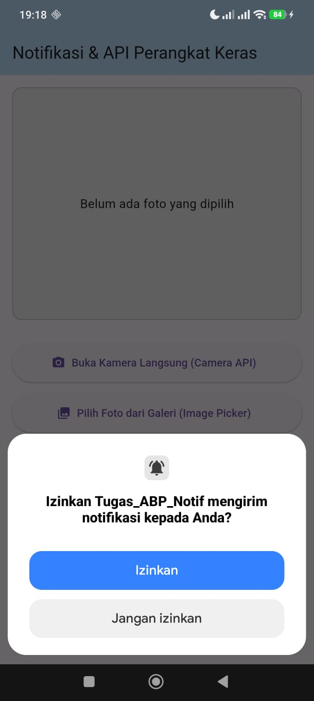

# 📱 Tugas ABP Notif

## 👨‍🎓 Identitas Mahasiswa

* Nama: Afrizal Dwi Nugraha
* NIM : 2311102136
* Mata Kuliah: Pemrograman Aplikasi Bergerak
* Tugas: API Perangkat Keras & Notifikasi Lokal

---

# Deskripsi Aplikasi

Aplikasi Flutter yang mengimplementasikan akses perangkat keras Android berupa kamera dan galeri, serta menampilkan notifikasi lokal ketika gambar berhasil dipilih atau diambil.

---

# Screenshot Hasil

## Tampilan Awal


## Mengambil Foto dengan Kamera


## Memilih Foto dari Galeri


## Notifikasi Lokal




---

# Penjelasan Widget

### MaterialApp

Digunakan sebagai widget utama aplikasi untuk mengatur tema, title, dan halaman utama aplikasi.

### Scaffold

Digunakan sebagai struktur dasar halaman yang menyediakan AppBar dan Body.

### AppBar

Menampilkan judul aplikasi pada bagian atas layar.

### SingleChildScrollView

Memungkinkan tampilan dapat di-scroll ketika ukuran layar tidak mencukupi.

### Padding

Memberikan jarak antar komponen agar tampilan lebih rapi.

### Column

Digunakan untuk menyusun widget secara vertikal.

### Container

Digunakan sebagai area untuk menampilkan gambar yang dipilih atau diambil.

### Center

Menempatkan widget tepat di tengah area yang tersedia.

### Text

Menampilkan teks informasi kepada pengguna.

### Image.file

Menampilkan gambar yang dipilih dari galeri atau hasil foto kamera.

### ElevatedButton.icon

Membuat tombol dengan ikon dan teks untuk membuka kamera maupun galeri.

### Icon

Menampilkan ikon kamera dan galeri pada tombol.

### SizedBox

Memberikan jarak antar widget.

---

# Implementasi API Perangkat Keras

## Camera API

Digunakan untuk mengambil gambar secara langsung menggunakan kamera perangkat.

Package yang digunakan:

```yaml
image_picker
```

## Gallery API

Digunakan untuk memilih gambar yang tersimpan pada galeri perangkat.

Package yang digunakan:

```yaml
image_picker
```

---

# Implementasi Notifikasi Lokal

Aplikasi menggunakan package:

```yaml
flutter_local_notifications
```

Fungsi notifikasi digunakan untuk memberikan informasi kepada pengguna bahwa gambar berhasil dipilih atau diambil.

---

# Struktur Project

```text
lib/
 └── main.dart

android/
test/
pubspec.yaml
README.md
```

---

# Cara Menjalankan

```bash
flutter pub get
flutter run
```
